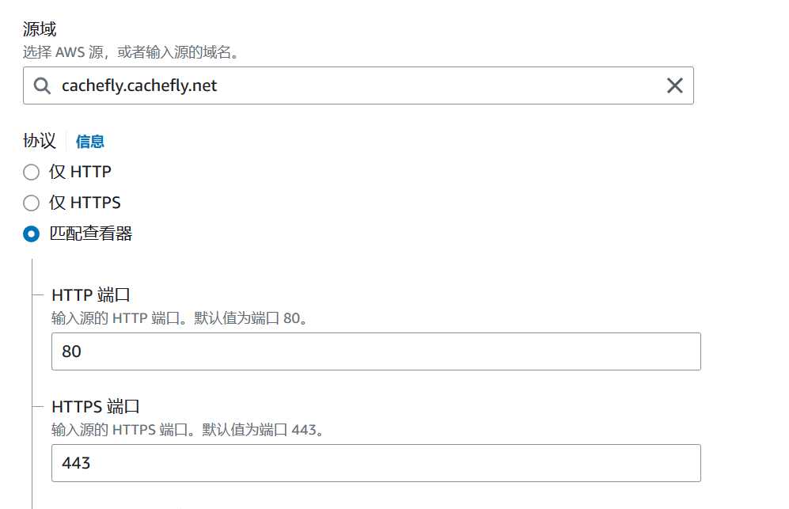

## 文件说明

get_gcore_ip.py  获取[gcore]()([Global Next-Gen CDN. Get Started For Free - Gcore](https://gcore.com/cdn)) 的CDN的ip列表.（对于Gcore如果没有测速地址，直接加-dd参数禁用册数即可）。

get_awscft_ip.py 获取CloudFront的CND的ip列表。 `aws_cft_ip.txt` 是运行该Python程序得到的不包含中国的IP列表。

### 建立CFT的测速地址

进入CFT首页，点击右上角创建分配。接下来在"源域"输入"[cachefly.cachefly.net](https://www.youtube.com/redirect?event=video_description&redir_token=QUFFLUhqbW5QZ0w0aDZMUGF0eHRnQU5jX2tHd0Ztc3RCZ3xBQ3Jtc0ttdmU5OWd1Zk9IbzBwMFBaV0hDRUh6X2wxS3lTcUt4c1FDWWRpV1Z3SWxTRm1GNXFiODJ1T2ZDamVxYTBHOEpwX2NYS25yR1Y0MnpMUVNhN2pFNkZrQURSMUxCRDE5eThHS1lNc3BsSTd6UGRobmxGZw&q=https%3A%2F%2Fcachefly.cachefly.net%2F100mb.test&v=MHFYRRo1Q8E)",”协议“选择匹配查看器”，

“自动压缩对象”选择“No”，缓存键和源清求选择为第二项，在最底下点击创建分配即可。




我们这时就可以看到CFT给我们分配cloudfront.net的二级域名，我们复制该域名，在其后添加 `/100mb.test` ，该地址即为我们的测试地址。其格式为

```
https://*.cloudfront.net/100mb.test
```

### 测速

运行get_awscft_ip.py程序，运行完毕之后会生成两个文件，一个是 `aws_ip.txt` ,包含了CFT的所有CDN服务器的IP，但其中有一部分是中国境内的IP，需要我们的域名备案后才能使用，需要剔除，而另一个文件 `aws_not_cn_ip.txt` 就是剔除了 `country_id` 为CN的IP段。

我们下载[测速工具](https://github.com/XIU2/CloudflareSpeedTest/releases/tag/v2.2.2),根据自己的系统下载合适的版本，下载后解压，将我们生成的 `aws_not_cn_ip.txt`复制到该文件夹内，然后我们在该目录下打开终端，输入

```
.\CloudflareST.exe -f .\aws_cft_ip_not_cn.txt -url https://*.cloudfront.net/100mb.test 
```

其中-url后的测速地址根据CFT分配的二级域名进行替换。各个参数含义参考原项目[README文件](https://github.com/XIU2/CloudflareSpeedTest#-%E8%BF%9B%E9%98%B6%E4%BD%BF%E7%94%A8).
